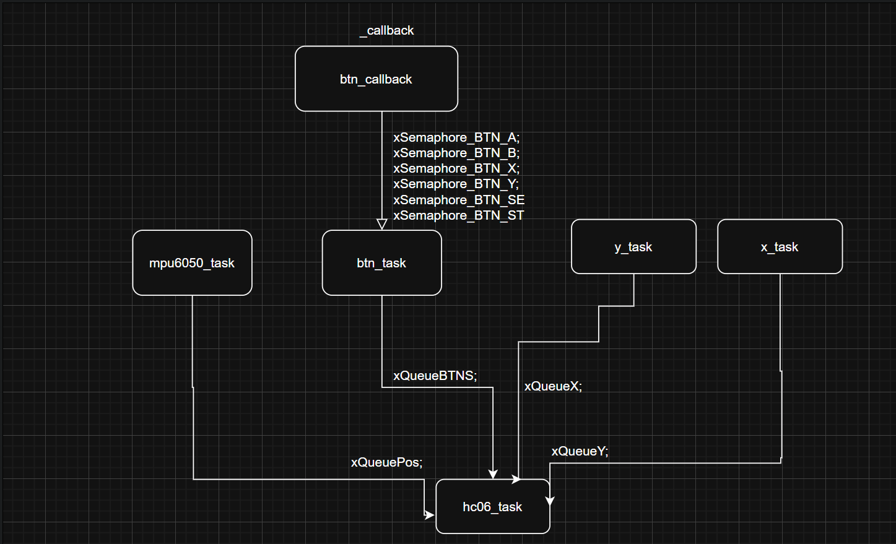

# Controle Customizado para Mortal Kombat (SNES)

## Jogo
O controle foi desenvolvido para o clássico jogo de luta **Mortal Kombat** do **Super Nintendo (SNES)**.

## Ideia do Controle
A proposta é um dispositivo com:
- **Botões físicos** para ataques, defesa e ações especiais.
- **Joystick analógico** para movimentação (cima, baixo, esquerda e direita).
- **Acelerômetro (MPU6050)** para detectar movimentos bruscos e executar golpes especiais.
- Comunicação **Bluetooth** com o computador via módulo **HC-06**.

## Inputs e Outputs

### Entradas (Inputs)
- **Botões Físicos:**
  - `BTN_A`: Golpes diversos / defesa dependendo do personagem
  - `BTN_B`: Golpes diversos / defesa dependendo do personagem
  - `BTN_X`: Golpes diversos / defesa dependendo do personagem
  - `BTN_Y`: Golpes diversos / defesa dependendo do personagem
  - `BTN_SELECT`: Selecionar opções no jogo
  - `BTN_START`: Iniciar e selecionar opções

- **Entradas do Joystick:**
  - **GPx (GPIO28)**: Movimento Esquerda/Direita
  - **GPy (GPIO27)**: Movimento Cima/Baixo

- **Acelerômetro (MPU6050):**
  - Detecta movimentos bruscos no eixo X para comandos especiais.

### Saídas (Outputs)
- Comunicação de comandos via **UART Bluetooth** para o computador, interpretando inputs como movimentos e ações no jogo.

---

## Protocolo Utilizado
- **UART (Universal Asynchronous Receiver-Transmitter)** para transmissão de pacotes de dados via Bluetooth.
- **GPIO Interrupts** para captura rápida e eficiente dos eventos de botões.

---

## Diagrama de Blocos Explicativo do Firmware

---

## Principais Componentes do RTOS

### Tasks
- `x_task`: Leitura do eixo X (Esquerda/Direita) do joystick analógico.
- `y_task`: Leitura do eixo Y (Cima/Baixo) do joystick analógico.
- `btn_task`: Captura de eventos dos botões físicos usando interrupções GPIO.
- `mpu6050_task`: Leitura do acelerômetro para detectar movimentos bruscos.
- `hc06_task`: Envio dos comandos capturados via UART Bluetooth.

### Filas (Queues)
- `xQueueBTNS`: Fila de eventos dos botões físicos.
- `xQueueX`: Fila de eventos do eixo X do direcional.
- `xQueueY`: Fila de eventos do eixo Y do direcional.
- `xQueuePos`: Fila de eventos do acelerômetro (movimentos especiais).

### Semáforos (Semaphores)
- `xSemaphore_BTN_A`
- `xSemaphore_BTN_B`
- `xSemaphore_BTN_X`
- `xSemaphore_BTN_Y`
- `xSemaphore_BTN_SELECT`
- `xSemaphore_BTN_START`

Cada botão tem seu próprio semáforo para garantir a sincronização correta dos eventos capturados por interrupção.

### Interrupts
- **GPIO IRQs** para detectar borda de descida nos botões (`falling edge`).
---

## Imagens do Controle

